# UNIVERSIDAD DE SAN CARLOS DE GUATEMALA

**FACULTAD DE INGENIERÍA**

**PRÁCTICAS INICIALES**

**SECCIÓN C**

**PRIMER SEMESTRE 2025**

## Proyecto Final

**Nombre : Carné :**

> Adilzon Alfredo Velásquez Hernández 201908076
>
> Arelis Esther Orozco Hernández 202300465
>
> Mario Rodrigo Balam Churunel 202200147

**Guatemala, Sábado 02 de Mayo del 2026**

---

## INTRODUCCIÓN

En la actualidad, la automatización del hogar permite mejorar la comodidad, seguridad y eficiencia energética dentro de una vivienda. En este proyecto se desarrolló una maqueta funcional de una casa inteligente, la cual integra diferentes componentes electrónicos controlados mediante un Arduino.

El sistema permite controlar la iluminación de diferentes ambientes, activar un ventilador, manipular una puerta mediante un servomotor y ejecutar diferentes modos de funcionamiento. Además, se incorporó el uso de memoria EEPROM para almacenar configuraciones y la comunicación mediante Bluetooth para el control remoto.

---

## OBJETIVOS

### Objetivo General

Diseñar e implementar una maqueta funcional de una casa inteligente capaz de controlar luces, ventilador y puerta, utilizando Arduino, memoria EEPROM y comunicación Bluetooth.

### Objetivos Específicos

- Implementar control de iluminación por ambientes mediante LEDs.
- Utilizar memoria EEPROM para almacenar configuraciones.
- Permitir el control remoto mediante Bluetooth.
- Mostrar el estado del sistema en una pantalla LCD.
- Implementar validación de comandos mediante archivo .org.

---

## Descripción del Sistema

El sistema consiste en una maqueta de una casa con cinco ambientes:

- Sala
- Comedor
- Cocina
- Baño
- Habitación

Cada ambiente cuenta con LEDs que representan iluminación.

Además:

- Se implementó un motor DC como ventilador.
- Un servomotor para la puerta.
- Un módulo Bluetooth para control remoto.
- Una pantalla LCD para mostrar información.
- LEDs indicadores para estado del sistema.

El Arduino actúa como unidad central de control, procesando comandos y gestionando todos los dispositivos.

---

## DISEÑO E IMPLEMENTACIÓN

### Arduino y pantalla

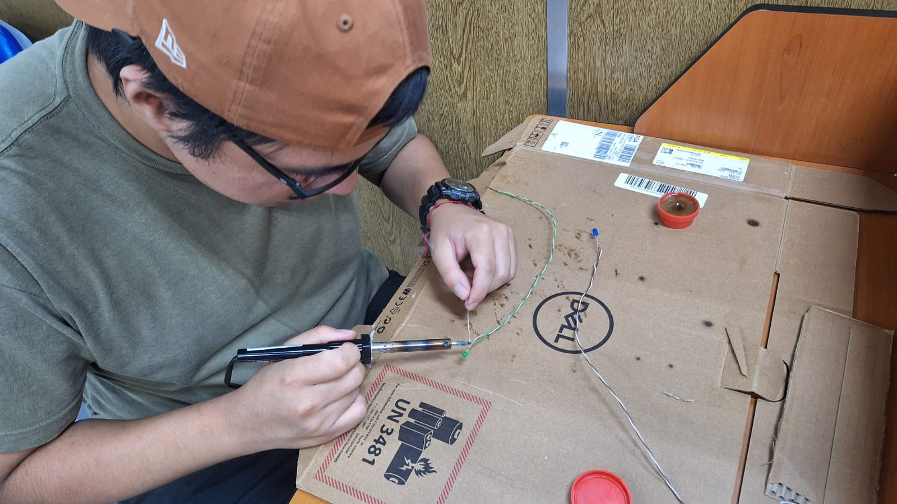

### Iluminación habitaciones

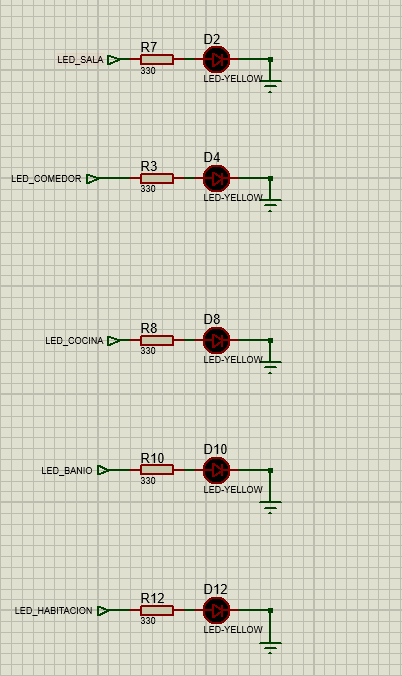

### Ventilador (motor)

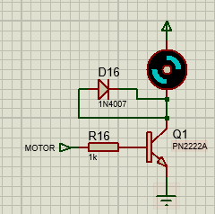

### Puerta (servo motor)

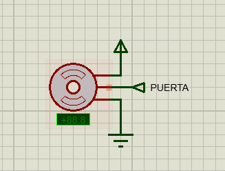

### LEDs indicadores

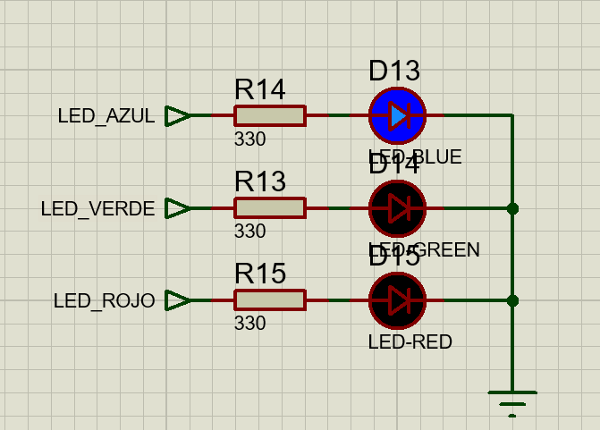

---

## Código Fuente

```cpp
// ================= LIBRERÍAS =================
// Permiten usar los diferentes módulos del sistema
#include <Wire.h> // Comunicación I2C (LCD)
#include <LiquidCrystal_I2C.h> // Control de pantalla LCD
#include <Servo.h> // Control de servomotor (puerta)
#include <EEPROM.h> // Memoria no volátil
#include <SoftwareSerial.h> // Comunicación Bluetooth

// ================= CONFIGURACIÓN DE MÓDULOS =================
// RX, TX del Bluetooth
SoftwareSerial BT(13, A0);
// Dirección del LCD (0x27 es común)
LiquidCrystal_I2C lcd(0x27, 16, 2);

// ================= DEFINICIÓN DE PINES =================
const int pinServo = 9; // Control de la puerta
const int pinBotonPuerta = 2; // Botón físico
const int pinVentilador = 3; // Motor DC (PWM)
const int pinLedAzul = 4; // Sistema activo
const int pinLedVerde = 5; // Éxito
const int pinLedRojo = 6; // Error

// Pines de LEDs por ambiente
const int pinsAmbientes[] = {7, 8, 10, 11, 12};
// Orden: Sala, Comedor, Cocina, Baño, Habitación

// ================= VARIABLES GLOBALES =================
Servo miPuerta; // Objeto servo
bool puertaAbierta = false;
int posActual = 0; // Posición actual del servo

// Variables para modo fiesta (sin delay)
bool modoFiestaActivo = false;
unsigned long tiempoAnteriorFiesta = 0;
bool estadoLucesFiesta = false;

// ================= SETUP =================
void setup() {
  // Inicialización de comunicación
  Serial.begin(9600); // PC
  BT.begin(9600); // Bluetooth

  // Inicialización LCD
  lcd.init();
  lcd.backlight();

  // Configuración del servo
  miPuerta.attach(pinServo);
  miPuerta.write(0); // Puerta cerrada

  // Configuración de pines
  pinMode(pinBotonPuerta, INPUT_PULLUP);
  pinMode(pinVentilador, OUTPUT);
  pinMode(pinLedAzul, OUTPUT);
  pinMode(pinLedVerde, OUTPUT);
  pinMode(pinLedRojo, OUTPUT);

  // Configuración de LEDs de ambientes
  for(int i=0; i<5; i++)
    pinMode(pinsAmbientes[i], OUTPUT);

  // Recuperar estado guardado en EEPROM
  recuperarEstadoEEPROM();

  // Indicar sistema listo
  digitalWrite(pinLedAzul, HIGH);
  lcd.setCursor(0, 0);
  lcd.print("CASA INTELIGENTE");
  lcd.setCursor(0, 1);
  lcd.print("SISTEMA LISTO");
  delay(2000);
  lcd.clear();
}

// ================= EEPROM =================
// Guarda el estado de un ambiente en memoria
void guardarEstadoEEPROM(int ambiente, int estado) {
  EEPROM.update(ambiente, estado);
}

// Recupera los estados al encender el sistema
void recuperarEstadoEEPROM() {
  for(int i=0; i<5; i++) {
    int estado = EEPROM.read(i);
    digitalWrite(pinsAmbientes[i], estado);
  }
}

// ================= ACTUADORES =================
// Movimiento suave del servo (abrir/cerrar puerta)
void moverPuerta(int destino) {
  if (posActual < destino) {
    for (int i = posActual; i <= destino; i++) {
      miPuerta.write(i);
      delay(25);
    }
  } else {
    for (int i = posActual; i >= destino; i--) {
      miPuerta.write(i);
      delay(25);
    }
  }
  posActual = destino;
}

// Apaga todo el sistema
void apagarTodo() {
  modoFiestaActivo = false;
  analogWrite(pinVentilador, 0);
  for(int i=0; i<5; i++) {
    digitalWrite(pinsAmbientes[i], LOW);
    guardarEstadoEEPROM(i, LOW);
  }
}

// ================= ARCHIVO .org =================
// Procesa archivo de configuración recibido por Serial
void analizarArchivoOrg(String datos) {
  // Formato esperado:
  // conf_ini|1,0,1,1,0|150|conf:fin
  int p1 = datos.indexOf('|');
  int p2 = datos.indexOf('|', p1 + 1);
  int p3 = datos.indexOf('|', p2 + 1);

  // Validación de estructura
  if (p1 != -1 && p2 != -1 && p3 != -1) {
    String subLuces = datos.substring(p1 + 1, p2);
    String subVent = datos.substring(p2 + 1, p3);

    // Configuración del ventilador
    int vel = subVent.toInt();
    analogWrite(pinVentilador, vel);

    // Configuración de LEDs
    int ambIdx = 0;
    for(int i = 0; i < subLuces.length(); i++) {
      char c = subLuces.charAt(i);
      if(c == '1' || c == '0') {
        int edo = (c == '1') ? HIGH : LOW;
        digitalWrite(pinsAmbientes[ambIdx], edo);
        guardarEstadoEEPROM(ambIdx, edo);
        ambIdx++;
        if(ambIdx >= 5) break;
      }
    }
    mostrarEstado("CONFIG CARGADA", true);
  } else {
    mostrarEstado("ERROR FORMATO", false);
  }
}

// ================= LOOP =================
void loop() {
  // ===== MODO FIESTA =====
  // Parpadeo sin bloquear el programa
  if (modoFiestaActivo) {
    unsigned long tActual = millis();
    if (tActual - tiempoAnteriorFiesta >= 300) {
      tiempoAnteriorFiesta = tActual;
      estadoLucesFiesta = !estadoLucesFiesta;
      for(int i=0; i<5; i++) {
        digitalWrite(pinsAmbientes[i],
          (i % 2 == 0) ? estadoLucesFiesta : !estadoLucesFiesta);
      }
    }
  }

  // ===== BOTÓN =====
  if (digitalRead(pinBotonPuerta) == LOW) {
    delay(50);
    puertaAbierta = !puertaAbierta;
    if (puertaAbierta) {
      mostrarEstado("ABRIENDO...", true);
      moverPuerta(90);
    } else {
      mostrarEstado("CERRANDO...", true);
      moverPuerta(0);
    }
    while(digitalRead(pinBotonPuerta) == LOW);
  }

  // ===== LECTURA DE DATOS =====
  String entrada = "";
  if (BT.available() > 0)
    entrada = BT.readStringUntil('\n');
  else if (Serial.available() > 0)
    entrada = Serial.readStringUntil('\n');

  if (entrada != "") {
    entrada.trim();
    procesarComando(entrada);
  }
}

// ================= COMANDOS =================
void procesarComando(String cmd) {
  // Verifica si es archivo .org
  if (cmd.startsWith("conf_ini")) {
    if (cmd.endsWith("conf:fin")) {
      analizarArchivoOrg(cmd);
    } else {
      mostrarEstado("ERROR SINTAXIS", false);
    }
    return;
  }

  // ===== MODOS =====
  if (cmd == "modo_fiesta") {
    apagarTodo();
    modoFiestaActivo = true;
    analogWrite(pinVentilador, 125);
    mostrarEstado("MODO: FIESTA", true);
  }
  else if (cmd == "modo_relajado" || cmd == "modo_noche") {
    apagarTodo();
    mostrarEstado("MODO: RELAJADO", true);
  }
  else if (cmd == "abrir_puerta") {
    puertaAbierta = true;
    mostrarEstado("ABRIENDO...", true);
    moverPuerta(90);
  }
  else if (cmd == "cerrar_puerta") {
    puertaAbierta = false;
    mostrarEstado("CERRANDO...", true);
    moverPuerta(0);
  }
  else if (cmd == "encender_todo") {
    modoFiestaActivo = false;
    analogWrite(pinVentilador, 125);
    for(int i=0; i<5; i++) {
      digitalWrite(pinsAmbientes[i], HIGH);
      guardarEstadoEEPROM(i, HIGH);
    }
    mostrarEstado("TODO ENCENDIDO", true);
  }
  else if (cmd == "apagar_todo") {
    apagarTodo();
    mostrarEstado("TODO APAGADO", true);
  }
  else {
    mostrarEstado("CMD INVALIDO", false);
  }
}

// ================= MENSAJES =================
void mostrarEstado(String msg, bool exito) {
  lcd.clear();
  lcd.setCursor(0,0);
  lcd.print(msg);

  // Indicadores visuales
  digitalWrite(exito ? pinLedVerde : pinLedRojo, HIGH);
  delay(500);
  digitalWrite(exito ? pinLedVerde : pinLedRojo, LOW);
}

## Formato del Archivo .org

El archivo .org permite configurar los modos del sistema desde una computadora.

**Ejemplo:**

conf_ini

// Modo fiesta
modo_fiesta
Ventilador: ON
LED'S: Alternandose

conf:fin

**Funcionamiento:**

- conf_ini → inicio del archivo
- conf:fin → fin del archivo
- Se validan los comandos
- Se guardan en EEPROM
- Si hay error → LED rojo + mensaje en LCD

## Uso de la EEPROM

La memoria EEPROM se utiliza para almacenar configuraciones de los modos del sistema.

**Funcionamiento:**

- Se guarda cada línea del archivo .org
- Los datos permanecen aunque el Arduino se reinicie
- Se escribe de forma secuencial en memoria

| Dirección EEPROM | Ambiente | Pin Arduino | Valor Guardado | Descripción           |
|------------------|----------|-------------|----------------|-----------------------|
| 0                | Sala     | 7           | 0 o 1          | LED apagado/encendido |
| 1                | Comedor  | 8           | 0 o 1          | LED apagado/encendido |
| 2                | Cocina   | 10          | 0 o 1          | LED apagado/encendido |
| 3                | Baño     | 11          | 0 o 1          | LED apagado/encendido |
| 4                | Habitació| 12          | 0 o 1          | LED apagado/encendido |

- Cada dirección guarda el estado de un ambiente.
- Se utiliza:
  - 0 → LED apagado
  - 1 → LED encendido
- Se usa EEPROM.update() para evitar escrituras innecesarias.
- Al iniciar el sistema, se recuperan los datos con: EEPROM.read(i);

## PRESUPUESTO

| No. | Componente         | Cantidad | Precio Unitario (Q) | Subtotal  |
|-----|--------------------|----------|---------------------|-----------|
| 1 | Display LCD 2X16     | 1        | 39.00               | 39.00     |
| 2 | Modulo de interfase  | 1        | 19.00               | 19.00     |
| 3 | Motor Servo Analogo  | 1        | 40.00               | 49.00     |
| 4 | Protoboard           | 2        | 39.00               | 78.00     |
| 5 | Moto DC              | 1        | 10.00               | 10.00     |
| 6 | Arduino 1            | 1        | 90.00               | 90.00     |
| 7 | Cable (metro)        | 10       | 2.50                | 25.00     |
| 8 | Push botón           | 1        | 1.50                | 1.50      |
| 9 | Led 5mm              | 8        | 2.00                | 16.00     |
| 10 | Resistencias 1 kΩ   | 10       | 2.00                | 10.00     |
| 11 | Bornera 2 contactos | 8        | 3.00                | 24.00     |
| 12 | cable Dumpont 20cm  | 3        | 3.50                | 10.50     |
| | **TOTAL**              |                                | **372.00**|

## APORTE INDIVIDUAL

- Adilzon Alfredo Velásquez Hernández: Creación del informe, diseño e implementación del control de luces, diseño de la casa
- Arelis Esther Orozco Hernández: Diseño e implementación para controlar el controlador DC, diseño de la casa
- Mario Rodrigo Balam Churunel: Diseño e implementación del controlador servo análogo y programación del Arduino, diseño de la casa

**Fotos de la maqueta terminada**

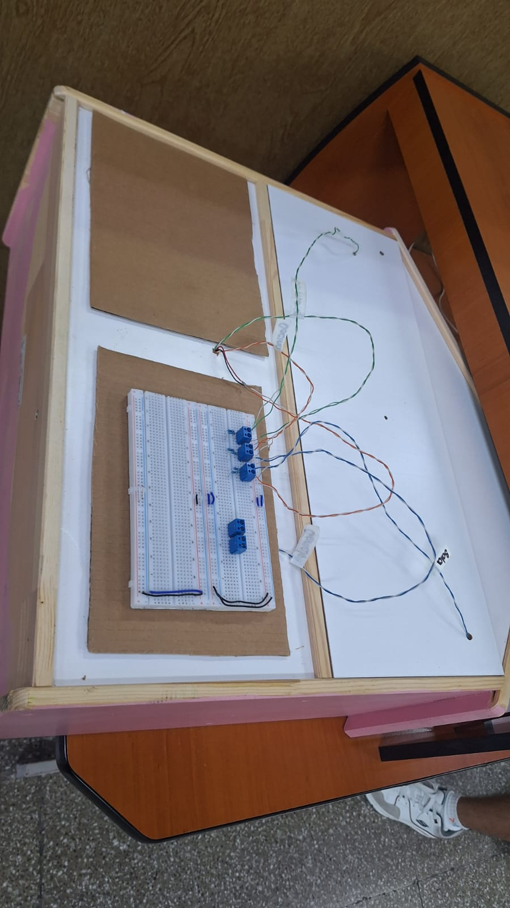

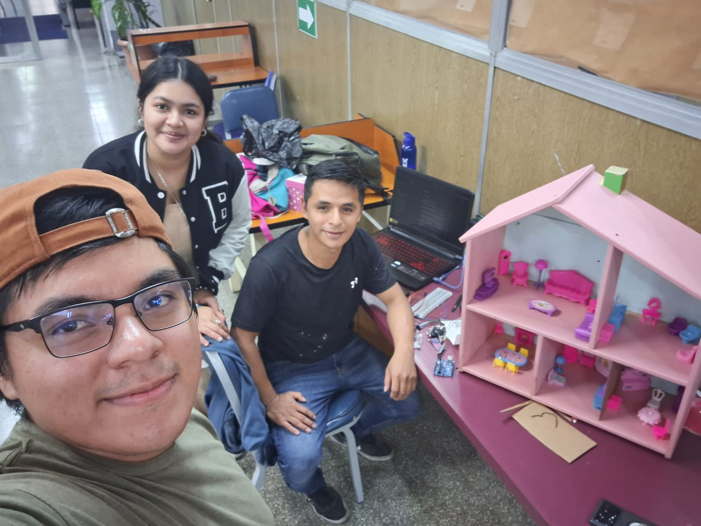

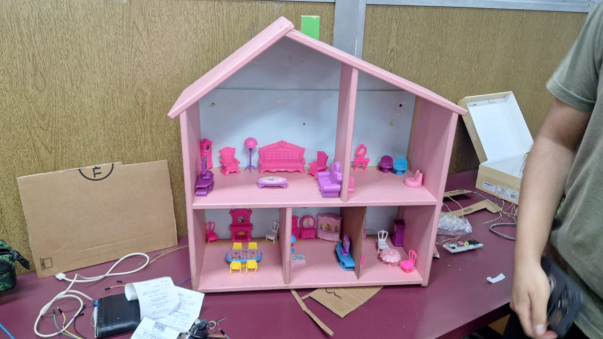

## CONCLUSIONES

1. Se logró implementar un sistema de autenticación digital funcional, el cual permite controlar el acceso al carrusel de manera eficiente, demostrando que el uso de contraseñas de 4 bits mediante lógica secuencial es una solución viable para restringir la operación a usuarios autorizados.

2. El módulo de detección y conteo de intentos fallidos cumplió con su propósito al registrar correctamente los accesos incorrectos y activar un sistema de alerta al alcanzar el límite establecido, evidenciando la importancia de integrar mecanismos de seguridad en sistemas automatizados.

3. El control bidireccional del motor, junto con la temporización y la sincronización de indicadores visuales, permitió simular de manera efectiva el funcionamiento de un carrusel automatizado, validando la correcta integración de los distintos módulos del sistema y su operación coordinada.

## ANEXOS

> Elaboración propia. Repositorio de github del grupo no. 4 del Laboratorio de Organización Computacional. Sección C.
> https://github.com/Ares-O/LABORGA_1S2026_G4.git


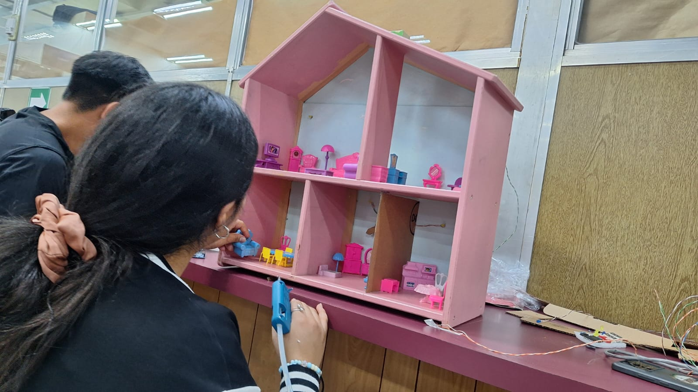

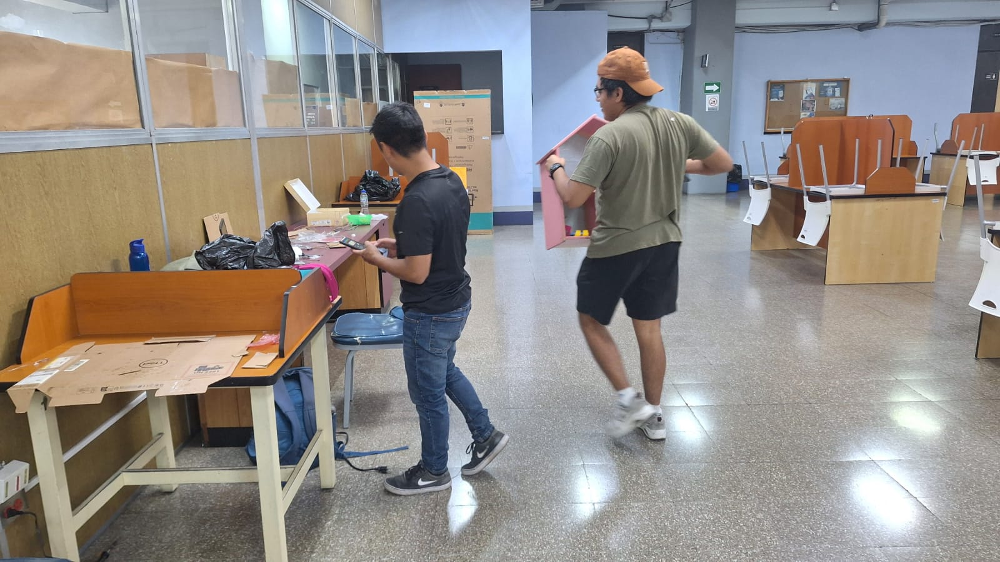
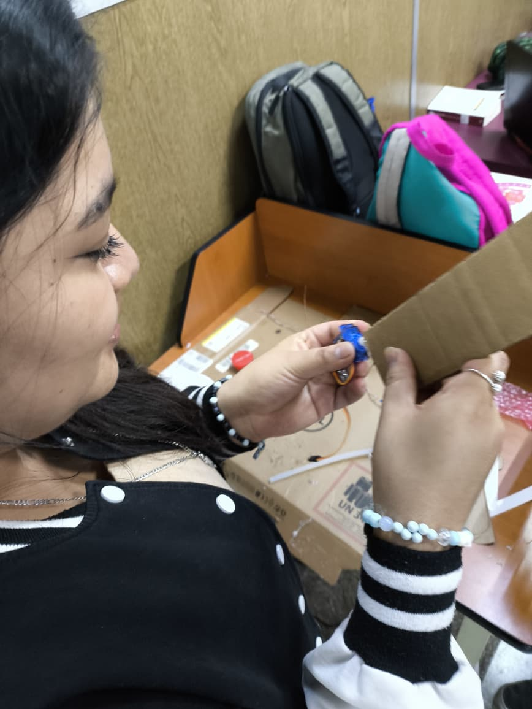
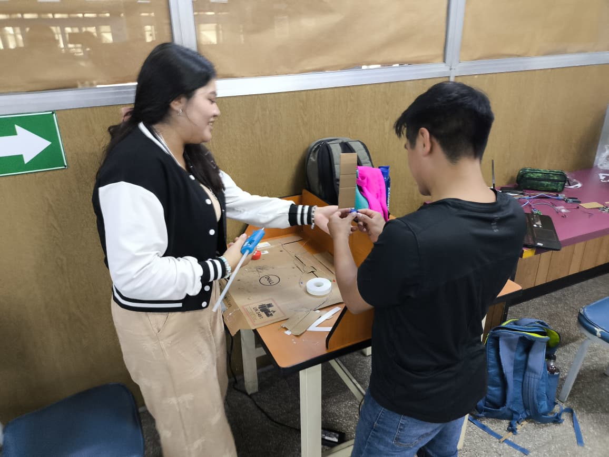
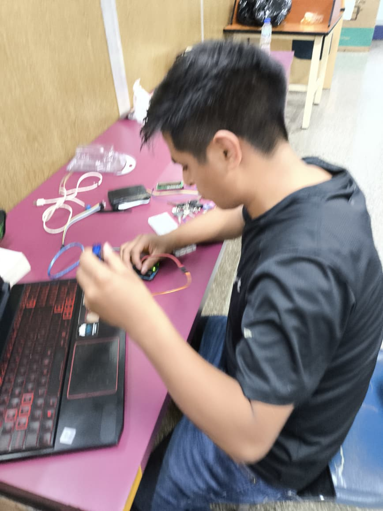
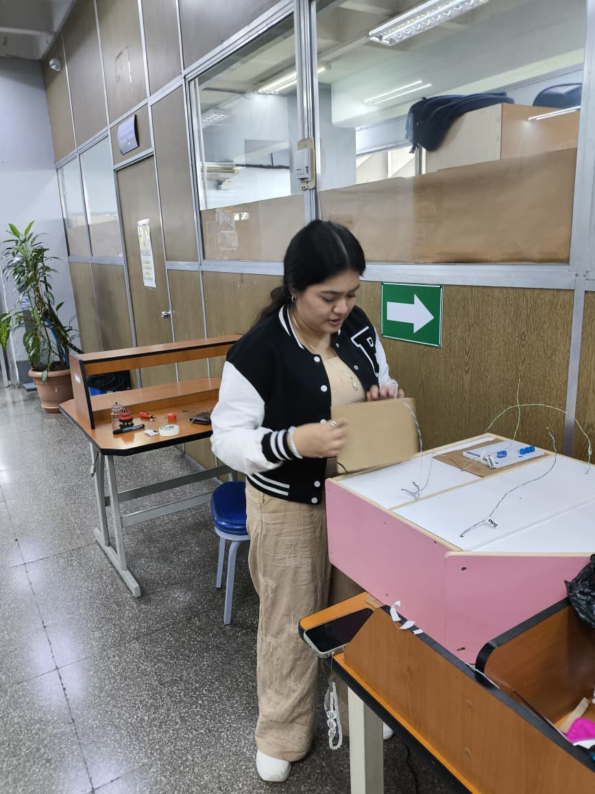
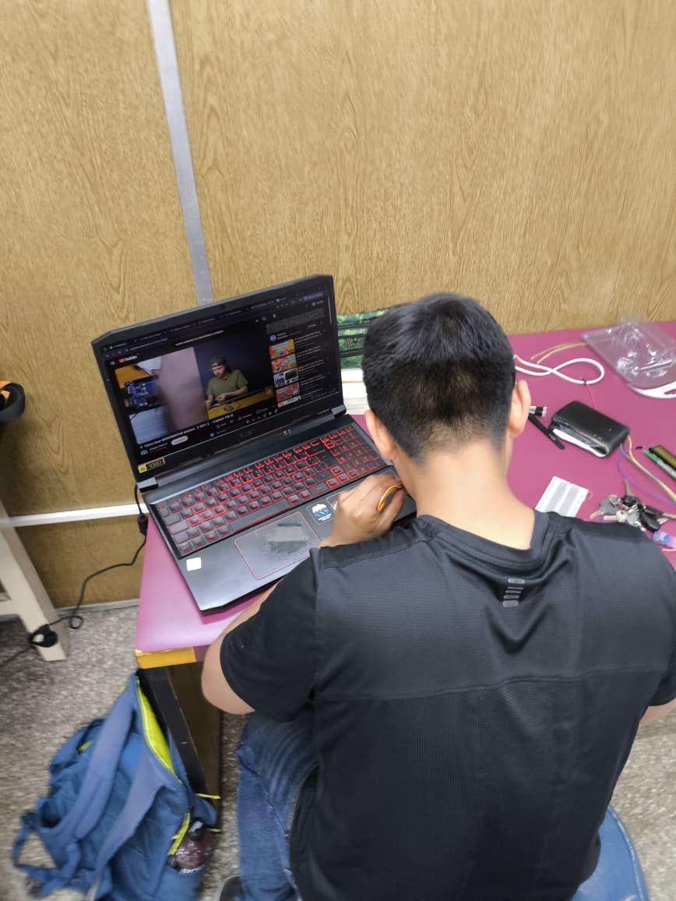